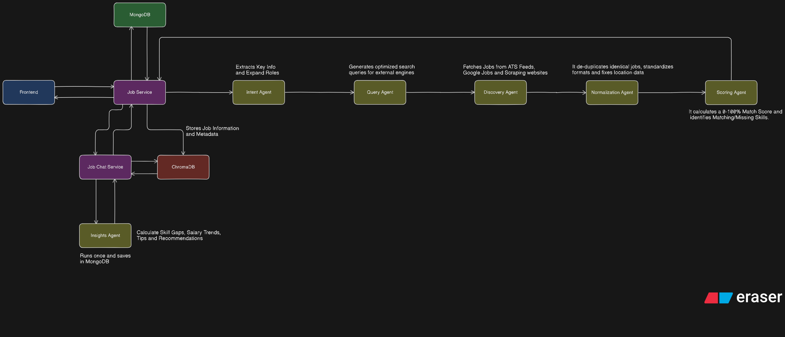
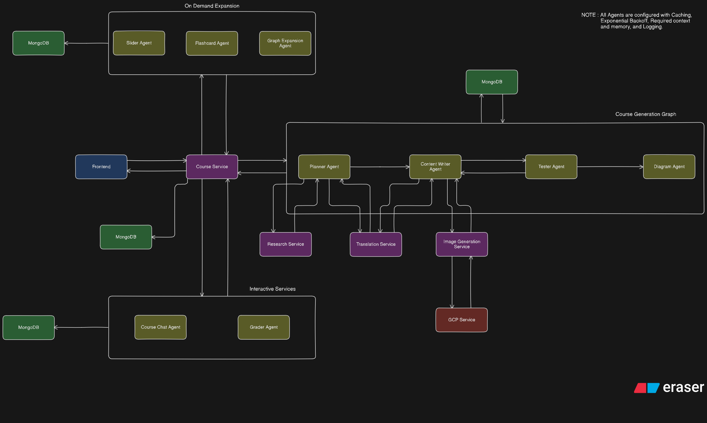
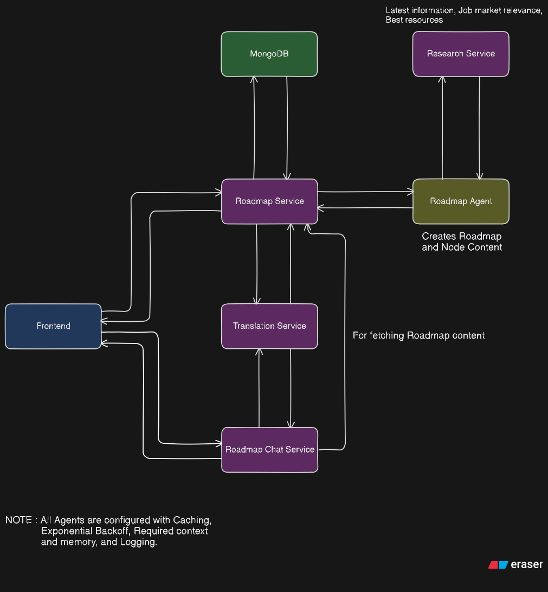
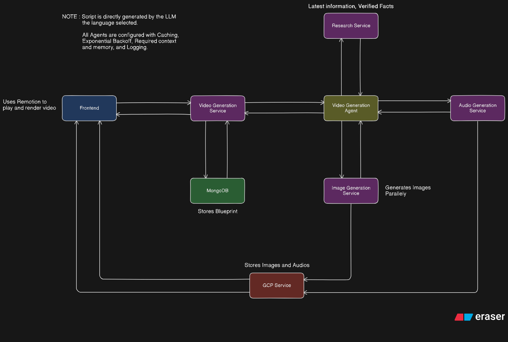
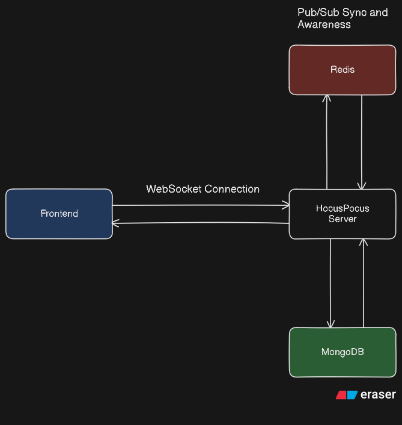
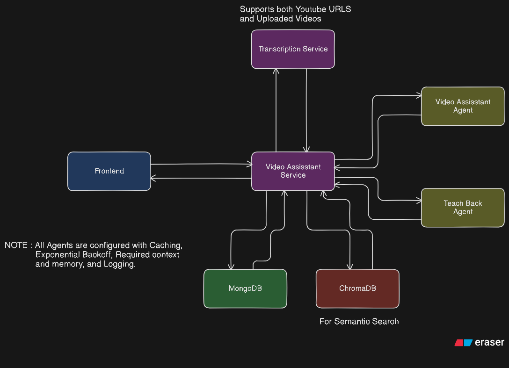
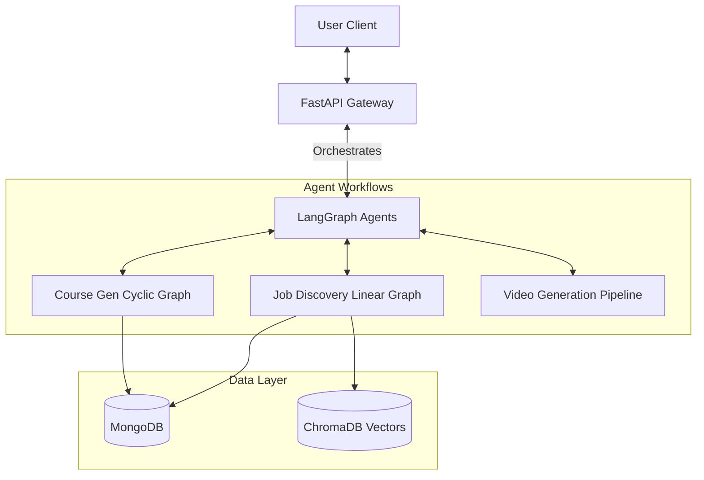

# Lumina 🚀

**Lumina** is the ultimate AI-powered ecosystem for career growth and education. It combines autonomous agents, generative AI, and real-time collaboration to help you **Find Work**, **Learn Skills**, and **Plan Your Future**—all in one platform.


## 🌟 The 6 Core Features

Lumina isn't just one tool; it's a suite of 6 intelligent engines working together.

### 1. Intelligent Job Discovery 💼
Stop mindless scrolling. Lumina uses a **5-Agent Pipeline** to scour the web, aggregate listings, and score them against your resume.
*   **Lazy Insights**: Get deep market analysis (salary trends, skill gaps) only when you truly need it.
*   **Semantic Chat**: Ask "Which of these jobs allows 4-day workweeks?" and get answers based on the actual job descriptions.



### 2. Generative Courses 🏫
Turn any topic into a full interactive course in seconds.
*   **Generative UI**: The AI doesn't just write text; it writes **Usage: React Code** to render interactive diagrams and simulations on the fly.
*   **Progressive Loading**: Start learning Chapter 1 while the AI is still researching Chapter 5.



### 3. Smart Career Roadmaps 🗺️
Visualize your path from "Junior" to "CTO".
*   **Graph-Based Planning**: Uses a Directed Acyclic Graph (DAG) to map out dependencies between skills.
*   **AI Guidance**: A dedicated Roadmap Assistant answers questions like "Why do I need to learn Docker before Kubernetes?"



### 4. AI Video Generation 🎥
Create educational content from text prompts using **Flux Models**.
*   **Scene Understanding**: The AI breaks your script into visual scenes.
*   **Audio Synthesis**: Automatically generates voiceovers to match the video flow.



### 5. Collaborative Notes 📝
A Notion-like editor built for peer learning.
*   **Real-Time Sync**: Powered by **Y.js** and WebSockets for seamless multi-user editing.
*   **AI Auto-Complete**: Press `++` to have the AI write the next paragraph for you.



### 6. Video Assistant (Chat with YouTube) 🤖
Learn from video content without watching the whole thing.
*   **RAG on Transcripts**: Indexes video captions so you can search for specific concepts.
*   **Instant Summaries**: Get the key takeaways from an hour-long lecture in 30 seconds.



---

## 🏗️ Architecture

### Technology Stack

| Domain | Technolgies |
|--------|-------------|
| **Backend** | Python, FastAPI, **LangGraph** (Orchestration), Pydantic |
| **Frontend** | React 18, Vite, **TanStack Query**, Framer Motion, TailwindCSS |
| **AI / LLM** | OpenAI (GPT-4o), Google (Gemini 1.5), Groq (Llama 3), **Flux** (Image/Video) |
| **Data** | **MongoDB** (Core), **ChromaDB** (Vector Search), Redis (Caching) |
| **Tools** | **SerpAPI** (Jobs), **Tavily** (Research), **Y.js** (Collaboration) |

### System Design overview


---

## 🤖 Agent Breakdown

### Job Agents
| Agent | Role |
|-------|------|
| **Intent** | Parses "Remote React Jobs" -> Search Params |
| **Query** | Generates SEO-optimized search strings |
| **Discovery** | Aggregates jobs from Glassdoor/LinkedIn/Indeed |
| **Scoring** | Ranks jobs 0-100% against your Resume |
| **Insights** | (Lazy) Generates market analysis on command |

### Course Agents
| Agent | Role |
|-------|------|
| **Planner** | Builds the Dependency Graph (Syllabus) |
| **Writer** | Generates structured JSON content |
| **Tester** | Creates Quizzes for each chapter |
| **Diagram** | **Writes Executable React Code** for visuals |

---

## 🚀 Quick Start

### 1. Prerequisites
-   Python 3.10+
-   Node.js 18+ (npm or bun)
-   MongoDB (Running locally or Atlas URI)

### 2. Backend Setup
```bash
cd fastapi-server
python -m venv venv
# Windows
.\venv\Scripts\activate
# Linux/Mac
source venv/bin/activate

pip install -r requirements.txt
cp .env.example .env  # Add your API Keys!
python main.py
```

### 3. Frontend Setup
```bash
cd client
npm install
npm run dev
```

Visit `http://localhost:5173` to explore **Lumina**.

---

## 🔧 Troubleshooting

### "Diagrams not rendering in courses?"
The `Diagram Agent` generates raw React code. If it fails, check the browser console. The frontend uses `react-live` with a constrained scope (`recharts`, `lucide-react`). If the AI imports an unknown library, it will error safely.

### "Job Search returns 0 results?"
Check your `SERPAPI_KEY`. Also, ensure you are not rate-limited. The `Discovery Agent` logs detailed output to the console—check there first.

---
**Lumina** — *The Future of Work and Learning.*
